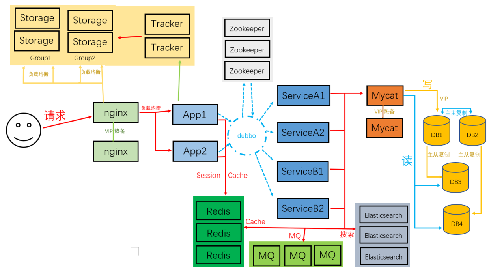

##### 设置
[设置静态ip](../Linux 配置/设置静态ip.md)
[添加sudo权限](../Linux 配置/用户添加sudo权限.md)
[修改主机名与ip映射表](../Linux 配置/主机名访问.md)
[关闭防火墙](../Linux 配置/防火墙-firewalld.md)
安装wget  ```$ yum install -y wget```
[国内yum和epel源](../Linux 配置/使用国内yum和epel源.md)
[同步网络时间](../Linux 配置/同步网络时间.md)


##### 安装软件
[安装 JDK8](02-安装-JDK8.md)
[安装 Redis](04-安装-Redis.md)&emsp;&emsp;[Redis 集群](13-Redis-集群.md)
[安装 MySQL8](03-安装-MySQL8.md)&emsp;&emsp;[MySQL 集群](12-MySQL-集群.md)
[安装 Zookeeper](07-安装-Zookeeper.md)&emsp;&emsp;[Zookeeper 集群](16-Zookeeper-集群.md)
[安装 ElasticSearch](05-安装-ElasticSearch.md)&emsp;&emsp; [ElasticSearch 集群](14-ElasticSearch-集群.md)
[安装 RabbitMQ](06-安装-RabbitMQ.md)&emsp;&emsp;[RabbitMQ 集群](15-RabbitMQ-集群.md)
[安装 FastDFS](08-安装-FastDFS.md)&emsp;&emsp;[FastDFS 集群](18-FastDFS-集群.md)
[安装 Nginx](09-安装-Nginx.md)&emsp;&emsp;[Nginx+Keepalived 实现主备切换](17-Nginx+Keepalived-实现主备切换.md)
[安装 Tomcat9](11-安装-Tomcat9.md)

按上面的步骤安装，如果要配置集群，复制虚拟机需要修改以下配置：
##### 1、IP地址

```vi /etc/sysconfig/network-scripts/ifcfg-eno16777736```

```
IPADDR=192.168.200.100
```
重启网络：```service network restart```失败
错误：正在打开环回接口： 无法载入文件 '/etc/sysconfig/network-scripts/ifcfg-lo'
修改mac地址：
```ip addr```查看mac地址
```
2: eno16777736: <BROADCAST,MULTICAST,UP,LOWER_UP> mtu 1500 qdisc pfifo_fast state UP qlen 1000
    link/ether 00:0c:29:d3:da:8d brd ff:ff:ff:ff:ff:ff
    inet 192.168.200.200/24 brd 192.168.200.255 scope global eno16777736
       valid_lft forever preferred_lft forever
    inet6 fe80::20c:29ff:fed3:da8d/64 scope link 
       valid_lft forever preferred_lft forever
```
```vi /etc/sysconfig/network-scripts/ifcfg-eno16777736```
```
HWADDR=00:0c:29:d3:da:8d
```

##### 2、设置主机名

```echo "centos-100" > /etc/hostname```

重启：```shutdown now -r```
