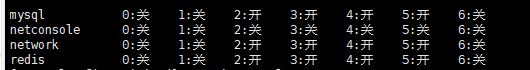

##### 1、在usr目录下建立mysql安装目录

```$ mkdir -p /usr/java ```

```$ cd /usr/java ```

使用ftp工具把安装包放到java目录下，解压

```$ xz -d mysql-8.0.15-linux-glibc2.12-x86_64.tar.xz```

```$ tar -xvf mysql-8.0.15-linux-glibc2.12-x86_64.tar```

创建mysql用户

```$ groupadd mysql```

```$ useradd -r -g mysql mysql```

```$ chown -R mysql:mysql mysql```

##### 2、安装

- 初始化

```$ /usr/java/mysql/bin/mysqld --initialize --user=mysql --basedir=/usr/java/mysql/ --datadir=/usr/java/mysql/data/```

- 查看初始密码

```
2019-03-08T01:30:05.228095Z 5 [Note] [MY-010454] [Server] A temporary 
password is generated for root@localhost: VQw,jdY;*0jr
```

密码为：```VQw,jdY;*0jr```

- 配置
查看初始化过程中有没有自动生成my.cnf 文件

​```$ cd /etc/ ```
​```$ ls | grep my.cnf   ```

添加超链接
```$ mkdir -p /usr/java/mysql/conf```
```$ ln -s /etc/my.cnf /usr/java/mysql/conf/my.cnf```
修改my.cnf
```$ vi /etc/my.cnf```
```
[mysqld]
datadir=/usr/java/mysql/data
basedir=/usr/java/mysql
port=3306
#default-authentication-plugin=mysql_native_password
character-set-server=utf8mb4
lower_case_table_names=1
socket=/tmp/mysql.sock
# Disabling symbolic-links is recommended to prevent assorted security risks
symbolic-links=0
# Settings user and group are ignored when systemd is used.
# If you need to run mysqld under a different user or group,
# customize your systemd unit file for mariadb according to the
# instructions in http://fedoraproject.org/wiki/Systemd

[mysqld_safe]
log-error=/usr/java/mysql/mariadb/log/mariadb.log
pid-file=/usr/java/mysql/mariadb/run/mariadb.pid

#
# include all files from the config directory
#
!includedir /etc/my.cnf.d
```
```$ mkdir -p /usr/java/mysql/mariadb/log```
```$ mkdir -p /usr/java/mysql/mariadb/run```
```$ touch  /usr/java/mysql/mariadb/log/mariadb.log```
```$ chown -R mysql:mysql /usr/java/mysql/mariadb```

- 设置环境变量：

```$ vi /etc/profile```

```
# MySQL Env
export  MYSQL_HOME=/usr/java/mysql
export  PATH=$PATH:$MYSQL_HOME/lib:$MYSQL_HOME/bin
```

​```$ source /etc/profile```


##### 3、添加到服务

​```$ cp /usr/java/mysql/support-files/mysql.server /etc/init.d/mysql```

 注册启动服务 ```$ chkconfig mysql on```

输入```$ chkconfig --list``` 查看是否添加成功。



开启服务器: ```$ service mysql start```

登陆 ```$ mysql -uroot -pVQw,jdY;*0jr ```


##### 4、修改密码

```sql
alter user  'root'@'localhost' identified by 'root';
```
##### 5、[添加用户并授权](https://www.cnblogs.com/sos-blue/p/6852945.html)
``` CREATE USER 'panqt'@'%' IDENTIFIED BY 'panqt';```
```GRANT ALL ON *.* TO 'panqt'@'%';```
```CREATE USER 'panqt'@'localhost' IDENTIFIED BY 'panqt';```
```GRANT ALL ON *.* TO 'panqt'@'localhost';```

通过navicat连接出错
```
2059 - authentication plugin 'caching_sha2_password'
```

``` ALTER USER 'panqt'@'%' IDENTIFIED WITH mysql_native_password BY 'panqt';```

##### 6、开放防火墙
添加：```$ sudo firewall-cmd --zone=public --add-port=3306/tcp --permanent ```
重启：```$ sudo firewall-cmd --reload```
查看：```$ firewall-cmd --zone=public --list-port```
