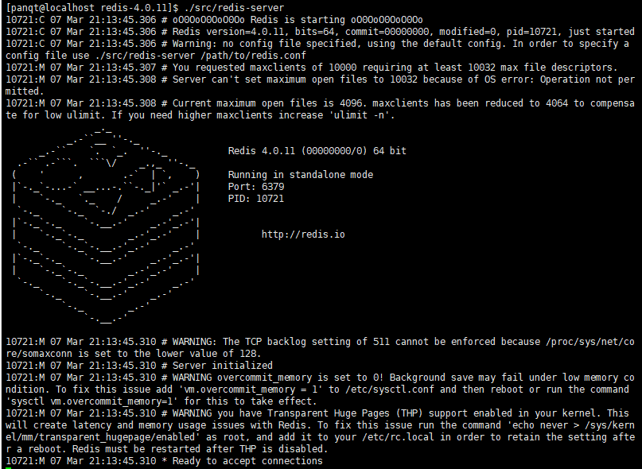
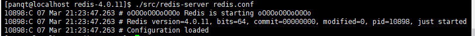
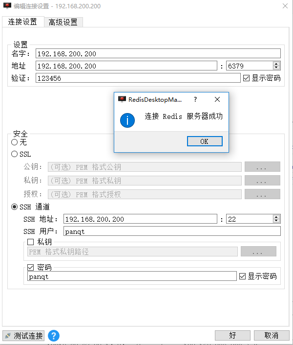

##### 1、安装gcc

查看gcc是否安装：```$ yum list installed | grep gcc``` 
```
[panqt@localhost redis-4.0.11]$ rpm -qa|grep gcc
libgcc-4.8.5-36.el7.x86_64
```
安装gcc：```$ yum -y install gcc ```

##### 2、在usr目录下建立目录并安装

```$ mkdir -p /usr/java ```
```$ cd /usr/java```

使用ftp工具把安装包放到redis目录下，解压

```$ tar -zxvf redis-4.0.11.tar.gz ```
```$ mv redis-4.0.11 redis```
```$ cd redis ``` 

```$ make```
``` $ make install```

前端启动：``` $ ./src/redis-server``` 
出现下图所示，说明安装成功


首先为了方便管理，将Redis文件中的conf配置文件和常用命令移动到统一文件中
```$ mkdir -p /usr/java/redis/bin```
```$ mkdir -p /usr/java/redis/conf```
```$ mv ./redis.conf  /usr/java/redis/conf/redis-6379.conf```
```$ cd src```
```$ mv mkreleasehdr.sh  redis-benchmark  redis-check-aof  redis-check-rdb  redis-cli  redis-sentinel  redis-server redis-trib.rb /usr/java/redis/bin```

##### 3、配置
- 后端启动方式
```$ vi /usr/java/redis/conf/redis-6379.conf```
```
bind 0.0.0.0 #允许所有ip访问本机
port 6379
daemonize yes #守护进程，后台启动
pidfile /var/run/redis_6379.pid
#requirepass 123456 #密码，集群不能设密码
```
[redis bind连不上的坑](https://www.cnblogs.com/suiyueqiannian/p/7808190.html)


设置密码后，要使用命令的方式连接，ip和端口可以省略：
``` $ /usr/java/redis/bin/redis-cli -h 192.168.200.100 -p 6379 -a 123456 ```

指定配置文件启动redis：```$ /usr/java/redis/bin/redis-server /usr/java/redis/conf/redis-6379.conf ```
此时，如下图，说明启动成功:


查看进程：``` $ ps -ef | grep redis```

停止进程：```$ /usr/java/redis/bin/redis-cli [-a 123456] [-p 6379] shutdown ```


##### 4、开放防火墙
添加：```$ sudo firewall-cmd --zone=public --add-port=6379/tcp --permanent ```
重启：```$ sudo firewall-cmd --reload```
查看：```$ firewall-cmd --zone=public --list-port```
```
[panqt@localhost redis-4.0.11]$ sudo firewall-cmd --zone=public --add-port=6379/tcp --permanent
success
[panqt@localhost redis-4.0.11]$ sudo firewall-cmd --reload 
success
[panqt@localhost redis-4.0.11]$ firewall-cmd --zone=public --list-port
6379/tcp
```
##### 5、远程访问
使用redis-desktop-manager连接


##### 6、添加到服务
```$ cp /usr/java/redis/utils/redis_init_script /etc/init.d/redis-6379```
```$ vi /etc/init.d/redis-6379```
```
#!/bin/sh
# Redis init.d script

REDISPORT=6379
REDIS_HOME=/usr/java/redis
EXEC=${REDIS_HOME}/bin/redis-server
CLIEXEC=${REDIS_HOME}/bin/redis-cli
PIDFILE=/var/run/redis_${REDISPORT}.pid
CONF="${REDIS_HOME}/conf/redis-${REDISPORT}.conf"
#PASSWORD="123456"

case "$1" in
    start)
        if [ -f $PIDFILE ]
        then
                echo "$PIDFILE exists, process is already running or crashed"
        else
                echo "Starting Redis server..."
                $EXEC $CONF
        fi
        ;;
    stop)
        if [ ! -f $PIDFILE ]
        then
                echo "$PIDFILE does not exist, process is not running"
        else
                PID=$(cat $PIDFILE)
                echo "Stopping ..."
                $CLIEXEC  -p $REDISPORT shutdown
                while [ -x /proc/${PID} ]
                do
                    echo "Waiting for Redis to shutdown ..."
                    sleep 1
                done
                echo "Redis stopped"
        fi
        ;;
    *)
        echo "Please use start or stop as first argument"
        ;;
esac

```
如果有密码，修改停止命令为 ``` $CLIEXEC -a $PASSWORD -p $REDISPORT shutdown ```

开启服务： ```$ chkconfig redis-6379 on ```

重启测试 ：```$ reboot ```
[Redis 集群](13-Redis-集群.md)