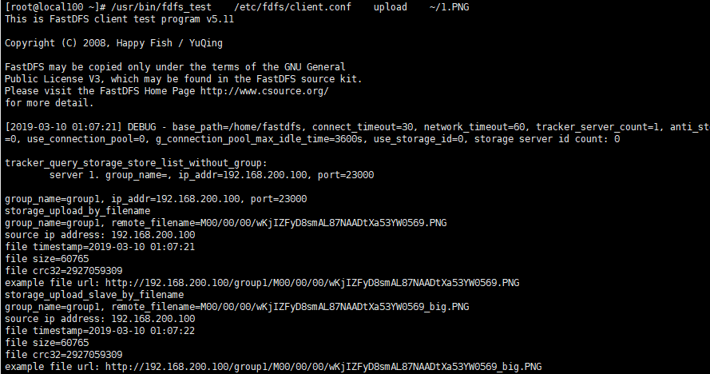

GitHub地址：https://github.com/happyfish100/FastDFS

##### 1、安装环境

```$ yum install gcc-c++```


##### 2、安装libevent

FastDFS依赖libevent库

```$ yum -y install libevent perl```


##### 3、安装libfastcommon

libfastcommon是FastDFS官方提供的，libfastcommon包含了FastDFS运行所需要的一些基础库。
```$ mkdir -p /usr/java```

```$ cd /usr/java```

```$ wget https://github.com/happyfish100/libfastcommon/archive/V1.0.39.tar.gz```

```$ tar -zxvf libfastcommon-1.0.39.tar.gz```

```$ cd libfastcommon-1.0.39```

```$ ./make.sh && ./make.sh install```

libfastcommon安装好后会自动将库文件拷贝至/usr/lib64下，由于FastDFS程序引用usr/lib目录所以需要将/usr/lib64下的库文件libfastcommon.so拷贝至/usr/lib下。（自己安装时，/usr/lib已有）

```$ cp /usr/lib64/libfastcommon.so /usr/lib/```


##### 4、安装tracker（同时安装了storage）
```$ cd /usr/java```

```$ wget https://github.com/happyfish100/fastdfs/archive/V5.11.tar.gz```

```$ tar -zxvf fastdfs-5.11.tar.gz```
```$ cd fastdfs-5.11```

```$ ./make.sh && ./make.sh install```

把安装的文件移动到自定义的文件夹中
```$ mkdir -p /usr/java/fastdfs/```
```$ ln -s /etc/fdfs /usr/java/fastdfs/conf```
```$ cp conf/mime.types conf/http.conf /etc/fdfs```

修改配置

```$ cd /usr/java/fastdfs/conf```
```$ cp tracker.conf.sample   tracker.conf```
```$ vi tracker.conf```
```properties
base_path=/home/fastdfs
```

```$ mkdir -p /home/fastdfs ```

启动(也是重启)

```$ /usr/bin/fdfs_trackerd  /usr/java/fastdfs/conf/tracker.conf restart ```


##### 5、安装storage

注意: 如果本服务器上已经安装过tracker,则只需修改storage配置即可(因为storage与tracker使用同一个安装包),如果服务器上没有安装过tracker需用执行步骤一和tracker的安装步骤(不需要配置,因为不使用tracker的功能)

安装libevent : 同tracker安装

安装libfastcommon : 同tracker安装。

storage编译安装 : 同tracker编译安装。


修改配置

```$ cd /usr/java/fastdfs/conf```

```$ cp storage.conf.sample storage.conf```

```$ vi storage.conf```

```properties
group_name=group1
base_path=/home/fastdfs
store_path0=/home/fastdfs/fdfs_storage
#如果有多个挂载磁盘则定义多个store_path，如下
#store_path1=......
#store_path2=......
tracker_server=centos-100:22122   #配置tracker服务器:IP注意此IP不能是127.0.0.1
#如果有多个则配置多个tracker
#tracker_server=.....
```

```$ mkdir -p /home/fastdfs/fdfs_storage```

启动(也是重启)

```$ /usr/bin/fdfs_storaged /usr/java/fastdfs/conf/storage.conf restart```


##### 6、测试

FastDFS安装成功可通过/usr/fastdfs/bin/fdfs_test测试上传、下载等操作。

修改配置

```$ cd /usr/java/fastdfs/conf```

```$ cp client.conf.sample client.conf```

```$ vi client.conf```

```properties
base_path=/home/fastdfs
tracker_server=centos-100:22122
```

使用格式：

/usr/bin/fdfs_test  客户端配置文件地址    upload     上传文件

```$ /usr/bin/fdfs_test   /usr/java/fastdfs/conf/client.conf    upload    1.jpg```




访问地址就是：

http://192.168.200.100/group1/M00/00/00/wKjIZFyD8smAL87NAADtXa53YW0569_big.PNG

因为未与nginx整合，所以暂时不能访问

##### 7、添加到服务

```$ chkconfig fdfs_storaged on```

```$ chkconfig fdfs_trackerd on```

##### 8、[FastDFS 和 Nginx 整合](10-FastDFS-和-Nginx-整合.md)
<br>
参考：
[Centos7安装部署fastDFS](https://blog.csdn.net/ityqing/article/details/82685533)
[FastDFS配置文件tracker.conf详解](https://blog.csdn.net/ityqing/article/details/82761464)
