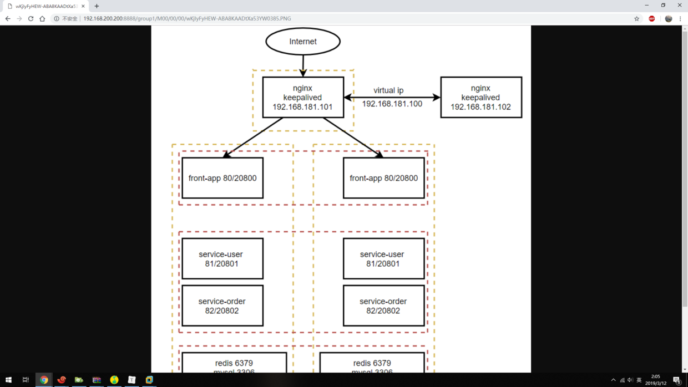

##### 1、安装 FastDFS
[Centos 7 安装 FastDFS](08-安装-FastDFS.md)

##### 2、配置 fastdfs-nginx-module
```$ cd /usr/java```
```$ wget https://github.com/happyfish100/fastdfs-nginx-module/archive/V1.20.tar.gz```
```$ tar -zxvf  fastdfs-nginx-module-1.20.tar.gz```
```$ mv fastdfs-nginx-module-1.20 fastdfs-nginx-module```

```$ vi fastdfs-nginx-module/src/config```
```
ngx_module_incs="/usr/include/fastdfs /usr/include/fastcommon/"
CORE_INCS="$CORE_INCS /usr/include/fastdfs /usr/include/fastcommon/"
```
[致命错误：common_define.h：没有那个文件或目录](https://blog.csdn.net/zzzgd_666/article/details/81911892) 在这里折磨了好久好久~
##### 3、安装 Nginx
[CentOS 7 安装 Nginx](09-安装-Nginx.md)
注意：使用安装包源码安装，```$ make``` 前，在 ```./configure``` 时，加上``` --add-module=/usr/java/fastdfs-nginx-module/src ```参数

##### 4、配置
```$ cp /usr/java/fastdfs-nginx-module/src/mod_fastdfs.conf /etc/fdfs/```
```$ vi /etc/fdfs/mod_fastdfs.conf```
```
tracker_server=centos-200:22122
url_have_group_name = true
store_path0=/home/fastdfs/fdfs_storage
```
```$ cd /usr/java/fastdfs-5.11/conf/```
```$ cp -f http.conf mime.types /etc/fdfs/```

```$ ln -s /home/fastdfs/fdfs_storage/data/ /home/fastdfs/fdfs_storage/data/M00```
```$ vi /usr/java/nginx/conf/nginx.conf```
```
server {
	listen 8888;
	server_name localhost;
	location ~/group([0-9])/M00 {
            #跨域
            add_header Access-Control-Allow-Origin *;
			add_header Access-Control-Allow-Methods 'GET, POST, OPTIONS';
			add_header Access-Control-Allow-Headers 'DNT,X-Mx-ReqToken,Keep-Alive,User-Agent,X-Requested-With,If-Modified-Since,Cache-Control,Content-Type,Authorization';

			if ($request_method = 'OPTIONS') {
				return 204;
			}

		root /home/fastdfs/fdfs_storage/data;
		ngx_fastdfs_module;
	}
}
```

##### 5、测试
```$ /usr/bin/fdfs_test /usr/java/fastdfs/conf/client.conf upload /usr/java/1.PNG```
```
[panqt@centos-200 ~]$ /usr/bin/fdfs_test /usr/java/fastdfs/conf/client.conf upload /usr/java/1.PNG
This is FastDFS client test program v5.11

Copyright (C) 2008, Happy Fish / YuQing

FastDFS may be copied only under the terms of the GNU General
Public License V3, which may be found in the FastDFS source kit.
Please visit the FastDFS Home Page http://www.csource.org/ 
for more detail.

[2019-03-12 09:54:55] DEBUG - base_path=/home/fastdfs, connect_timeout=30, network_timeout=60, 
tracker_server_count=1, anti_steal_token=0, anti_steal_secret_key length=0, use_connection_pool=0
, g_connection_pool_max_idle_time=3600s, use_storage_id=0, storage server id count: 0

tracker_query_storage_store_list_without_group: 
	server 1. group_name=, ip_addr=192.168.200.200, port=23000

group_name=group1, ip_addr=192.168.200.200, port=23000
storage_upload_by_filename
group_name=group1, remote_filename=M00/00/00/wKjIyFyHEW-ABA8KAADtXa53YW0385.PNG
source ip address: 192.168.200.200
file timestamp=2019-03-12 09:54:55
file size=60765
file crc32=2927059309
example file url: http://192.168.200.200/group1/M00/00/00/wKjIyFyHEW-ABA8KAADtXa53YW0385.PNG
```
访问路径记得加上端口：http://192.168.200.200:8888/group1/M00/00/00/wKjIyFyHEW-ABA8KAADtXa53YW0385.PNG

