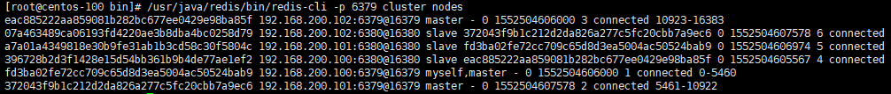

[安装 Redis](04-安装-Redis.md)

##### 1、安装环境与版本：

3个CentOS 7 虚拟机

6个Redis 实例

| 192.168.200.100 | 192.168.200.101 | 192.168.200.102 |
| --------------- | --------------- | --------------- |
| redis-6379      | redis-6379      | redis-6379      |
| redis-6380      | redis-6380      | redis-6380      |


##### 2、首先修改各实例配置

```
cluster-enabled yes
cluster-config-file nodes-6379.conf #注意改成实例的端口
cluster-node-timeout 5000
appendonly yes
```

将实例都启动。

```
[root@centos-101 init.d]# ps -ef | grep redis
root 10664 1 0 07:19 ? 00:00:01 /usr/java/redis/bin/redis-server 0.0.0.0:6379 [cluster]
root 10680 1 0 07:19 ? 00:00:01 /usr/java/redis/bin/redis-server 0.0.0.0:6380 [cluster]

```


###### 3、安装ruby (只需安装一台主机，创建集群)

```yum -y install ruby rubygems```

```gem install redis```

```
[root@centos-101 init.d]# gem install redis
Fetching: redis-4.1.0.gem (100%)
ERROR:  Error installing redis:
	redis requires Ruby version >= 2.2.2.

```

于是，要升级Ruby版本

```
$ gpg --keyserver hkp://keys.gnupg.net --recv-keys 409B6B1796C275462A1703113804BB82D39DC0E3 7D2BAF1CF37B13E2069D6956105BD0E739499BDB
$ curl -sSL https://get.rvm.io | bash -s stable
$ source /etc/profile.d/rvm.sh
$ rvm list known
$ rvm install 2.4.1
```

```gem install redis```

##### 4、创建集群

```cd /usr/java/redis/bin```

```
$ ./redis-trib.rb create --replicas 1 192.168.200.100:6379 192.168.200.101:6379 192.168.200.102:6379 192.168.200.100:6380 192.168.200.101:6380 192.168.200.102:6380 
```

--replicas 1表示我们想为每个master指定一个slave

redis-trib对主机名支持不好，所以用 ip:port


问题：

redis集群创建时报错：Sorry, can't connect to node 

bind 设置0.0.0.0，允许所有ip访问本机

ip，端口等都配置正确的话，还需要将redis.conf文件中的密码注释掉    # requirepass 123456


##### 5、测试

```/usr/java/redis/bin/redis-cli -p 6379 cluster nodes```
192.168.200.100:6379 master  ←  slave 192.168.200.101:6380
192.168.200.101:6379 master  ←  slave 192.168.200.102:6380
192.168.200.102:6379 master  ←  slave 192.168.200.100:6380



输如数据测试下：

```
[root@centos-100 bin]# ./redis-cli -c
127.0.0.1:6379> set hello world
OK
127.0.0.1:6379> set good  nice
OK
127.0.0.1:6379> set apple  iphone
-> Redirected to slot [7092] located at 192.168.200.101:6379
OK
192.168.200.101:6379> set banana  orange
-> Redirected to slot [9380] located at 192.168.200.102:6379
OK
192.168.200.102:6379> get hello
-> Redirected to slot [866] located at 192.168.200.100:6379
"world"
192.168.200.100:6379> get apple
-> Redirected to slot [7092] located at 192.168.200.101:6379
"iphone"
192.168.200.101:6379> 
```
可以看到插入与读取在各个节点间跳动

##### 6、粗暴的删除集群：
停止所有redis实例 ```service redis-6379 stop```
删除所有主机 appendonly.aof、dump.rdb、nodes-6379.conf ```rm -f /dump.rdb /*.aof /nodes-63*```
重启所有redis实例 ```service redis-6379 start```
重新创建集群

参考：

 [Redis 集群教程](http://www.redis.cn/topics/cluster-tutorial.html)

 [Redis集群](https://www.cnblogs.com/cjsblog/p/9048545.html)

 [redis常用集群方案](https://www.jianshu.com/p/1ecbd1a88924)

