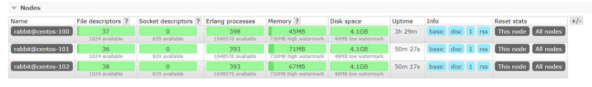
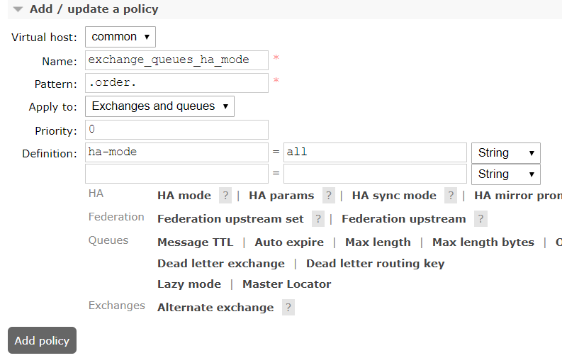
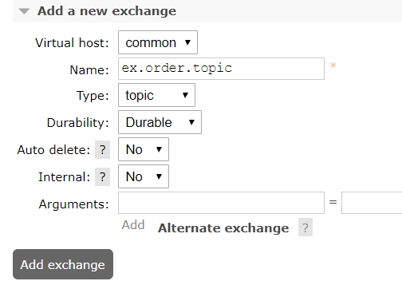
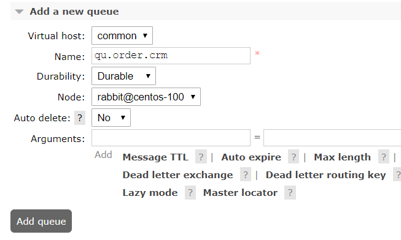
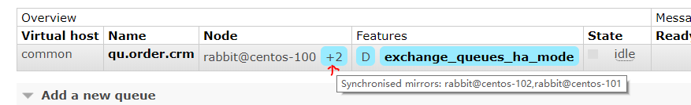

[安装 RabbitMQ](06-安装-RabbitMQ.md)

##### 1、安装环境与版本：

3个CentOS 7 虚拟机

3个RabbitMQ实例

| centos-100 | centos-101 | centos-102 | 
| --------------- | --------------- | --------------- | 

##### 2、配置erlang
找到.erlang.cookie的位置
```$ cd / && find -name .erlang.cookie```

所有节点内容设置成一样的
```$ chmod u+w ./root/.erlang.cookie```
```$ vi ./root/.erlang.cookie ```
```$ chmod u-w ./root/.erlang.cookie```

##### 3、创建集群
在centos-101、centos-102上执行下列命令
```$ cd /usr/java/rabbitmq/sbin```
```$ rabbitmqctl stop_app``` 注意不是停止rabbitmq程序
```rabbitmqctl join_cluster rabbit@centos-100``` ：将当前节点添加到centos-100的集群
```$ rabbitmqctl start_app```

节点连接成功


可以启动一个节点为RAM模式。
```$ rabbitmqctl change_cluster_node_type  ram```
[内存节点似乎并不能增加性能](http://www.rabbitmq.com/rabbitmqctl.8.html#Cluster_Management)

##### 4.Mirror queue policy设置
节点是准备好了，接下来我们需要设置exchange、queue 高可用策略，这样才能真的做到高可用。现在是物理上的机器或者说虚拟机节点是高可用的，但是里面的对象需要我们进行配置策略。
1. 创建一个属于自己业务范围内的vhost

2. 添加policie(策略)
我们定义了策略的匹配模式.order.，这样可以避免将所有的exchange、queue都镜像了。

3. 添加exchange

我们新建了一个ex.order.topic exchange，它的features中应用了exchange_queue_ha_mode策略。（相同的策略是无法叠加使用的。）其他的exchange并没有应用这个策略，是因为我们的pattern限定了只匹配.order.的名称。


4. 添加queue


创建一个qu.order.crm queue，注意看它的node属性里有一个”Synchronised mirrors:rabbit@centos-102,rabbit@centos-102“镜像复制。features里也应用了exchange_queue_ha_mode策略。这个时候，队列其实在3个节点里都是有的，虽然我们创建的时候是在rabbit@centos-100]里的，但是它会复制到集群里的其他节点。在创建HAmode的时候可以提供HA params参数，来限定复制节点的个数，这通常用来提高性能和HA之间的平衡。


[RabbitMQ 高可用集群搭建及电商平台使用经验总结](https://www.cnblogs.com/wangiqngpei557/p/6158094.html)
