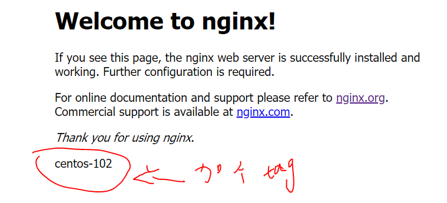
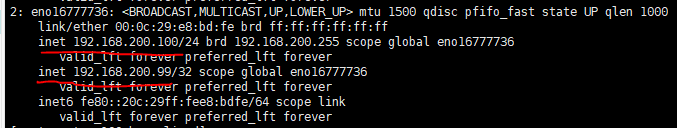
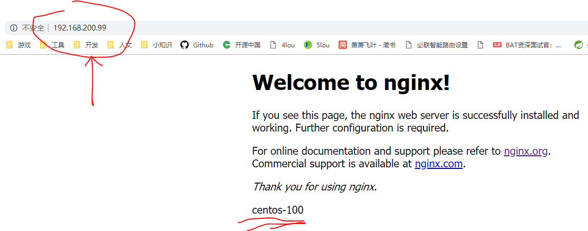
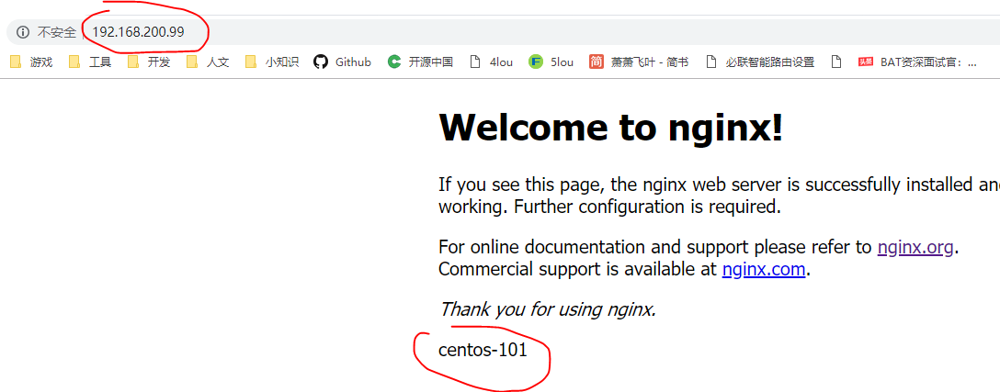

[安装 Nginx](06-安装-RabbitMQ.md)

##### 1、安装环境与版本：

3个CentOS 7 虚拟机 

3个Nginx实例
| centos-100 | centos-101 | centos-102 |
| --------------- | --------------- | --------------- |
|192.168.200.100 |192.168.200.101|192.168.200.102|
设置keepalived虚拟ip为192.168.200.99

##### 2、改nginx首页
```$ cd /usr/java/nginx/html/```
```$ vi index.html```
分别在首页上加上各主机ip，能在网页上访问，以便于后面测试ip



##### 3、安装keepalived
```$ mkdir -p /usr/java && cd /usr/java```
```$ wget http://www.keepalived.org/software/keepalived-2.0.13.tar.gz```
```$ tar -zxvf keepalived-2.0.13.tar.gz```
```$ cd keepalived-2.0.13```
```$ ./configure --prefix=/usr/java/keepalived --sysconf=/etc```
```$ make && make install```

```$ cp /usr/java/keepalived-2.0.13/keepalived/etc/init.d/keepalived /etc/init.d```
不要执行：```$ cp /usr/java/keepalived-2.0.13/keepalived/etc/sysconfig/keepalived /etc/sysconfig/```[Keepalived 开机启动问题](../问题收集/Keepalived-开机启动问题.md)

```$ ln -s /usr/java/keepalived/sbin/keepalived /sbin/keepalived```
```$ ln -s /etc/keepalived /usr/java/keepalived/conf```

```$ chkconfig --add keepalived```
```$ chkconfig --level 2345 keepalived on```
```$ service keepalived start```

##### 4、配置keepalived
```$ cd /etc/keepalived/```
```$ cp keepalived.conf{,.bak} ```
```$ vi keepalived.conf```
主机配置：
```
! Configuration File for keepalived


vrrp_script check_nginx_alive {  
	script "/etc/keepalived/check_nginx_alive.sh"   #检测nginx心跳，当nginx挂掉，kill掉keepalived,这样从机的keepalived服务就可以被调用
	interval 2   #2秒一次,主备一致
	weight -10   #权重-10，减的是keepalived的权重，当master的权重-20后，master权重小于slave，从而vip漂移到slave，（脚本里把master的keepalived kill了
}  

global_defs { #全局部分设置
   notification_email { #可以添加邮件提醒
     #acassen@firewall.loc #主从切换时发送邮件通知，这里是收件人地址
     #failover@firewall.loc
     #sysadmin@firewall.loc
   }
   #notification_email_from Alexandre.Cassen@firewall.loc #发件人地址
   #smtp_server 192.168.200.1 #邮件服务器地址
   #smtp_connect_timeout 30 #发送邮件超时时间
   router_id LVS_DEVEL_100  #必须全局唯一，主备不同
   #vrrp_skip_check_adv_addr
   #vrrp_strict
   #vrrp_garp_interval 0
   #vrrp_gna_interval 0
}

vrrp_instance VI_1 {#实例名称随便取
    state MASTER #指定keepalived的角色，MASTER为主，BACKUP为备
    interface eno16777736 #绑定VIP的网卡，需要和公网正常通信  
    virtual_router_id 51 #master和slave必须一样
    priority 102	#权重级别，大的为master
    advert_int 1	#主备机之间通信间隔，单位秒
    authentication {
        auth_type PASS #主从keepalived进行安全认证的方式，PASS或者AH方式，推荐PASS
        auth_pass 1111 #主从密码要一样
    }
    virtual_ipaddress {
        192.168.200.99	#vip地址，使用这个地址替换了主从的地址，用这个访问。VIP地址最多可以写20个，keepalive启动后会自动配置该处VIP
    }
	track_script {  
        check_nginx_alive  #调用脚本，vrrp_script后面的名称,不是脚本的名称
	} 
}

virtual_server 192.168.200.99 80 {
    delay_loop 6
    lb_algo rr
    lb_kind DR
	nat_mask 255.255.255.0
    #persistence_timeout 50
    protocol TCP

    real_server 192.168.200.100 80 { #实际服务器，这个nginx宕掉，马上切换成备机的nginx
        weight 1
        TCP_CHECK {
            connect_timeout 3
			nb_get_retry 3
            retry 3
            delay_before_retry 3
			connect_port 80
        }
    }
}
```
备机配置：
```
! Configuration File for keepalived


vrrp_script check_nginx_alive {  
	script "/etc/keepalived/check_nginx_alive.sh"   #检测nginx心跳，当nginx挂掉，kill掉keepalived,这样从机的keepalived服务就可以被调用
	interval 2   #2秒一次,主备一致
	weight -10   #权重-10，减的是keepalived的权重，当master的权重-20后，master权重小于slave，从而vip漂移到slave，（脚本里把master的keepalived kill了
}

global_defs { #全局部分设置
   notification_email { #可以添加邮件提醒
     #acassen@firewall.loc #主从切换时发送邮件通知，这里是收件人地址
     #failover@firewall.loc
     #sysadmin@firewall.loc
   }
   #notification_email_from Alexandre.Cassen@firewall.loc #发件人地址
   #smtp_server 192.168.200.1 #邮件服务器地址
   #smtp_connect_timeout 30 #发送邮件超时时间
   router_id LVS_DEVEL_101  #必须全局唯一，主备不同
   #vrrp_skip_check_adv_addr
   #vrrp_strict
   #vrrp_garp_interval 0
   #vrrp_gna_interval 0
}

vrrp_instance VI_1 {#实例名称随便取
    state BACKUP #指定keepalived的角色，MASTER为主，BACKUP为备
    interface eno16777736 #绑定VIP的网卡，需要和公网正常通信  
    virtual_router_id 51 #master和slave必须一样
    priority 101	#权重级别，大的为master
    advert_int 1	#主备机之间通信间隔，单位秒
    authentication {
        auth_type PASS #主从keepalived进行安全认证的方式，PASS或者AH方式，推荐PASS
        auth_pass 1111 #主从密码要一样
    }
    virtual_ipaddress {
        192.168.200.99	#vip地址，使用这个地址替换了主从的地址，用这个访问。VIP地址最多可以写20个，keepalive启动后会自动配置该处VIP
    }
	track_script {  
        check_nginx_alive  #调用脚本，vrrp_script后面的名称,不是脚本的名称
	} 
}

virtual_server 192.168.200.99 80 {
    delay_loop 6
    lb_algo rr
    lb_kind DR
	nat_mask 255.255.255.0
    #persistence_timeout 50
    protocol TCP

    real_server 192.168.200.101 80 { #实际服务器，这个nginx宕掉，马上切换成备机的nginx
        weight 1
        TCP_CHECK {
            connect_timeout 3
			nb_get_retry 3
            retry 3
            delay_before_retry 3
			connect_port 80
        }
    }
}
```
以上主节点的配置， 从节点backup配置和主节点一样，只是state要改成backup,  priority 值要比master小点即可，router_id，real_server  。

创建检测脚本：```$ vi /etc/keepalived/check_nginx_alive.sh```
```
#!/bin/bash    
if [ "$(ps -ef | grep "nginx: master process"| grep -v grep )" == "" ]    
then    
service nginx start   
sleep 5    
if [ "$(ps -ef | grep "nginx: master process"| grep -v grep )" == "" ]    
then    
killall keepalived    
fi    
fi 
```
```$ chmod +x /etc/keepalived/check_nginx_alive.sh```

```$ service nginx restart && service keepalived restart```


##### 5、测试
```$ ip addr```
网卡eno16777736 已经绑定 192.168.200.99



这时就能用192.168.200.99这个虚拟ip访问了，这时访问的是主机centos-100



kill掉主机的nginx```$ service nginx stop```
再访问192.168.200.99，已经跳到centos-101主机了


如果发现有错误的话可以查看系统日志，```$ tail -f  /var/log/messages```

##### 6、抢占模式和非抢占模式
keepalived的HA分为抢占模式和非抢占模式，抢占模式即MASTER从故障中恢复后，会将VIP从BACKUP节点中抢占过来。非抢占模式即MASTER恢复后不抢占BACKUP升级为MASTER后的VIP。 

*非抢占模式配置：*
1. 在vrrp_instance块下两个节点各增加了nopreempt指令，表示不争抢vip
2. 节点的state都为BACKUP
两个keepalived节点都启动后，默认都是BACKUP状态，双方在发送组播信息后，会根据优先级来选举一个MASTER出来。由于两者都配置了nopreempt，所以MASTER从故障中恢复后，不会抢占vip。这样会避免VIP切换可能造成的服务延迟。

[keepalived实现nginx的高可用](https://www.cnblogs.com/youzhibing/p/7327342.html)
[keepalived设置为公网IP](https://www.zhihu.com/question/39595620)