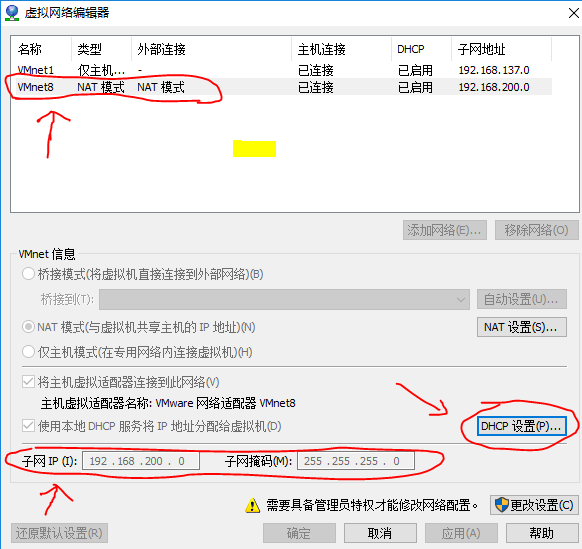

1、VMware编辑虚拟机网络编辑器，设置dhcp、子网和子网掩码。

2、windows网络适配器中把nat模式的网卡设置为自动获取ip和dns

如此，虚拟机网段就设置成为192.168.200.101--192.168.200.254
主机为192.168.200.1
wins服务器为192.168.200.2（网关，dns）
dhcp服务器为192.168.200.254

linux如何设置 [设置静态ip](设置静态ip.md)
